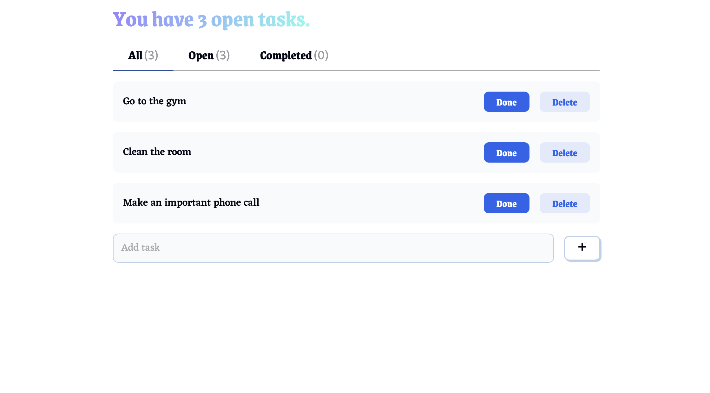

# Task Manager



## Description

Task Manager is a simple and efficient task management application designed to keep your workflow organized. It features a clean and well-designed user interface styled with the pre-styled CSS framework **FantaCSS**. The application allows users to easily add, track, and manage tasks, ensuring that all tasks are clearly categorized into three sections: **All**, **Open**, and **Completed**. This project demonstrates the ability to build a structured and user-friendly React.js application with a strong emphasis on UI/UX design.

## Features

- **Light & Dark Mode:** Seamlessly switch between light and dark themes for a comfortable user experience.
- **Add New Tasks**: Easily create new tasks and keep track of them.
- **Task Status Management**: Mark tasks as completed
- **Auto-Sorting**: Tasks are automatically sorted into relevant sections:
  - **All**: Displays all tasks.
  - **Open**: Shows only pending tasks.
  - **Completed**: Lists finished tasks.
- **Delete Tasks**: Remove completed or unnecessary tasks.
- **Modern UI**: Styled with **FantaCSS** for a sleek and consistent look.

## Demo

You can check out the project live at: [Task Manager Demo](https://todo-app-johnny.vercel.app)

## Technologies

The project is built using:

- **Vite** – Fast and modern frontend tooling.
- **React.js** – Efficient and component-based UI framework.
- **FantaCSS** – Pre-styled CSS framework for a beautiful interface.
- **JavaScript (ES6+)** – Modern JavaScript features.
- **HTML5 & CSS3** – Structuring and styling the application.

## Installation & Setup

To run this project locally, follow these steps:

1. Clone the repository:
   ```bash
   git clone https://github.com/your-username/task-manager.git
   cd task-manager
   ```
2. Install dependencies:
   ```bash
   npm install
   ```
3. Start the development server:
   ```bash
   npm run dev
   ```

## Why This Project?

Task Manager is more than just a simple to-do list. It demonstrates:
- The ability to structure and maintain a well-organized **React.js** project.
- The use of **FantaCSS** to create a visually appealing and intuitive UI.
- Best practices in managing component state and handling user interactions.

This project is a great example of combining clean UI design with effective task management functionality, making it a strong portfolio piece.
